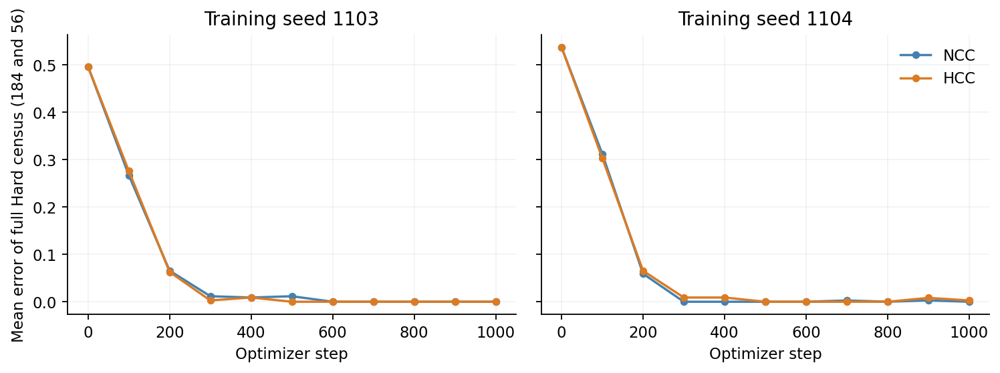
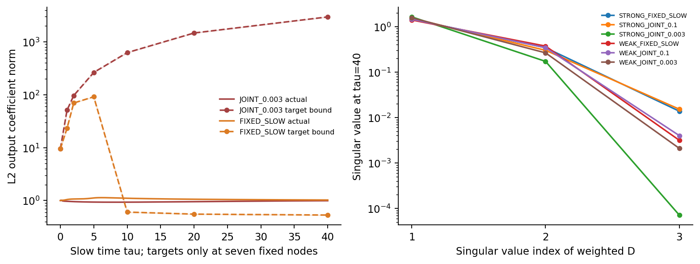

# Correction Delays in Shared-Scale Attention

**Archived research report · v0.6-archive · CLOSED after STEP18**

This project studied a distinction in attention: changing the ordering of useful information versus increasing concentration on the current ordering. A shared learned scale can delay correction in an explicitly restricted population model. The result depends on the loss, scale coordinates, initial key geometry, and trainable information paths.

The pretrained-model experiments **did not establish a repeatable training benefit from freezing scales or a general scale-mediated failure mechanism**. This does not prove that such effects are impossible in every Transformer. The project ended after STEP18; its results, negative evidence, code, and limits are preserved.

## What the record contains

| Experiment family | Purpose / changed factor | Result | Scope |
| --- | --- | --- | --- |
| Initial recall attempts | Establish basic retrieval before a scale test | Basic learning gate was not secured | Mechanism unjudged; no retrieval impossibility claim |
| Restricted theory and numerics | Joint versus fixed direct scale, Copy-MSE, prescribed initialization box | Sharp gradient-flow delay; separate finite-budget exact-real GD results | Fixed keys/readout, population law; not Adam or arbitrary queries |
| Learnable-QK bridge | Learn Q and K in a small finite-query task | Joint corrected ranking later, but final raw risk was lower | Ranking, accumulated risk, and endpoint risk differ |
| Swin–Waterbirds | Common clipping, scale update versus exclusion, two training seeds | Hard training error-area contrasts **+37/25760** and **−99/51520** | Freezing benefit did not replicate; validation metrics trade off |
| Qwen evidence and interventions | Matched Neutral/Confusable inputs; first-layer scale; all-layer radial signal | Decoys 10→22/128; P14=−1/128; Neutral and Confusable loss both decreased along tested direction | Controlled input effect; tested scale explanations unsupported |
| Controlled loss/geometry/path comparisons | Loss, direct/log scale, key geometry, Q sharing, raw Key–Value path | Both help and delay; 42/54 correction events, 12 physical-horizon censors | Deliberately limited models; raw Key–Value path differs from V/O |
| Attention-only V/O and saved-state analysis | One/three mixtures; factorized Value/Output learning; static coefficient requirement | P17=0; one endpoint needed coefficient norm ≈2964.68 versus actual ≈0.992 | Expressivity differs from learned attainment; 18 cumulative decompositions unresolved |

Here **risk** is population MSE in the controlled models, not classification accuracy. **Error-AUC** is a step-normalized trapezoid of error rates, not a speedup. **WGA** is the minimum accuracy across data groups. “Radial” refers to a common relative change in native Q/K gain vectors, not all possible direction learning.

## Read and reproduce

- [English manuscript source](manuscript/main.tex) and [preserved complete proof supplement](manuscript/supplement/PROOF_SUPPLEMENT_EN.md).
- [Experiment purposes, scales, results, and counterevidence](docs/EXPERIMENTS.md).
- [Scope and limitations](docs/SCOPE_AND_LIMITATIONS.md), [data and rights boundaries](docs/DATA_AND_LICENSES.md).
- [Metric-level evidence index](results/evidence_index.csv) and [numerical summary](results/summary.csv).
- [한국어 안내](README_KO.md).

From this archive's root, in an environment with the recorded dependencies:

~~~bash
python scripts/reproduce_summaries.py --input results --out reproduced
python scripts/reproduce_figures.py --input results --out reproduced/figures
python scripts/verify_public_bundle.py --root .
~~~

These commands read saved tables and small synthetic arrays. They do not download assets, run a neural model, train, differentiate a model, integrate an ODE, or optimize a readout. See [REPRODUCE.md](REPRODUCE.md) for the distinction between aggregate reproduction, array-based recalculation, and historical full reruns.

The archive manuscript was edited from the supplied v0.5 source. **PDF_NOT_BUILT:** no TeX compiler was available in the closeout environment. No old PDF is presented as the new version. The six PNG figures were regenerated and visually checked. The manuscript source includes a no-shell-escape [build script](manuscript/build.sh); PDF layout and page count remain unverified.

## Citation

Provisional title-first citation; approved public author metadata is pending:

> *Correction Delays in Shared-Scale Attention*. (2026). Research archive, **v0.6-archive**. Published **2026-10-08**. [Repository](https://github.com/Munsik-Kim/direction-scale-archive); [fixed record, commit e6b1b5aad87b48d9775ef4136a018ded277cfa81](https://github.com/Munsik-Kim/direction-scale-archive/tree/e6b1b5aad87b48d9775ef4136a018ded277cfa81).

`Munsik-Kim` is the repository-account identifier, not an attribution of an author's real name, sole authorship, or rights ownership. `v0.6-archive` identifies the document version, not a Git tag or GitHub Release. This bibliographic notice grants no license or reuse permission; see [rights and attribution](docs/DATA_AND_LICENSES.md#rights-and-attribution).

## Archive boundaries

Only selected authored material, aggregate native-model results, and small controlled-population states are distributed. Dataset text, question/answer/completion records, reconstructable token IDs, images, pretrained weights, large checkpoints, private provenance, and delivery receipts are excluded. QED annotation redistribution permission remains unverified. No project-wide reuse license or author identity is invented.

This research-record status does not make the GitHub repository read-only or prohibit independent research by others. There is no scheduled next experiment or automatic training stage. See [STATUS.md](STATUS.md).
